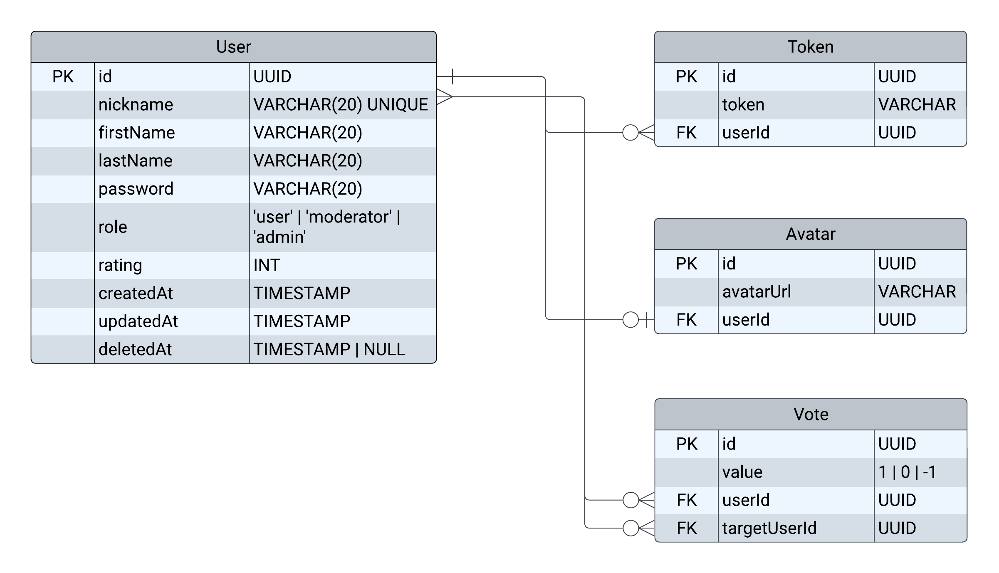

# User Management

&nbsp;&nbsp;
&nbsp;&nbsp;
&nbsp;&nbsp;
&nbsp;&nbsp;
&nbsp;&nbsp;
&nbsp;&nbsp;
&nbsp;&nbsp;

The service is responsible for user management, authentication and authorization
(with roles). It was created using NestJS, and PostgreSQL is used for data
storage through TypeORM. Interaction with AWS S3 for storing user avatars has
been implemented. The service also includes Swagger documentation and unit
tests, as well as end-to-end tests.

You can familiarize with the API through
[Swagger](https://ec2-52-58-90-89.eu-central-1.compute.amazonaws.com/um/api/docs).

To run the project locally, first install npm dependencies using the npm install
command and set environment variables in the `.env` file. See the example in the
`.env.example` file.

### To run the project use one of the following commands:

```bash
$ npm start

# in development mode
$ npm run start:dev
```

Base URL for local API deployment: `localhost:PORT/um/api/` Set the port value
in your `.env` file and replace PORT with the specified value before launching
the API server.

### The project consists of two main modules:

- auth - responsible for operations related to authentication
- user - implementing functionality for user editing, adding avatar and voting

### DB schema:


